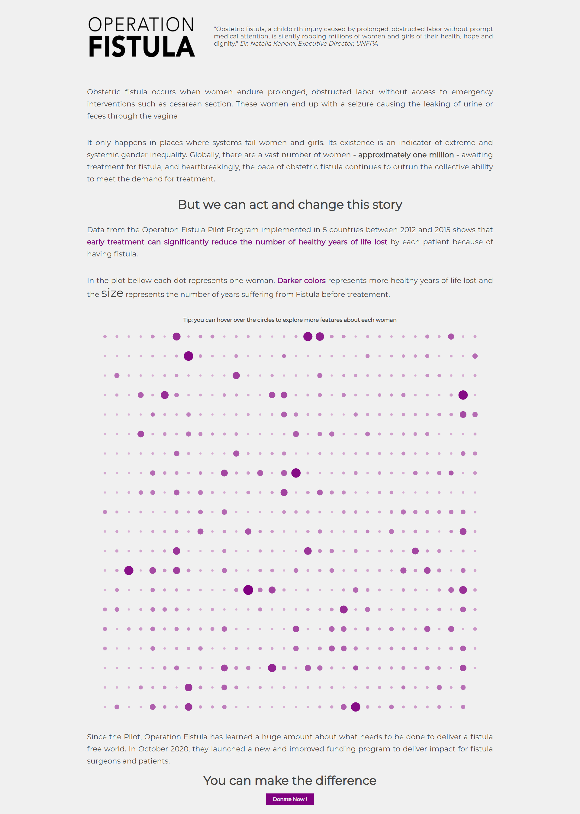

# MakeoverMonday

My contributions to [#MakeoverMonday](https://www.makeovermonday.co.uk/), a weekly social data project aimed at working with a given data set and create better, more effective visualizations and help us make information more accessible. The project was created in 2016 by [Eva Murray](https://twitter.com/TriMyData) and [Andy Kriebel](https://twitter.com/VizWizBI).

## 2020, Week 49: Divergent Opinions on Transatlantic Alliance 
  

## 2020, Week 48: The success of Operation Fistula’s Pilot Program 
  

