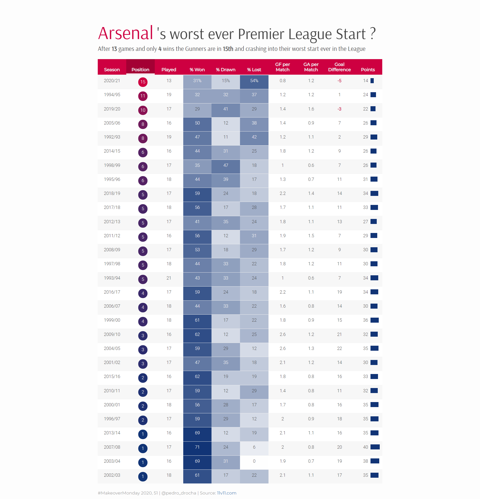
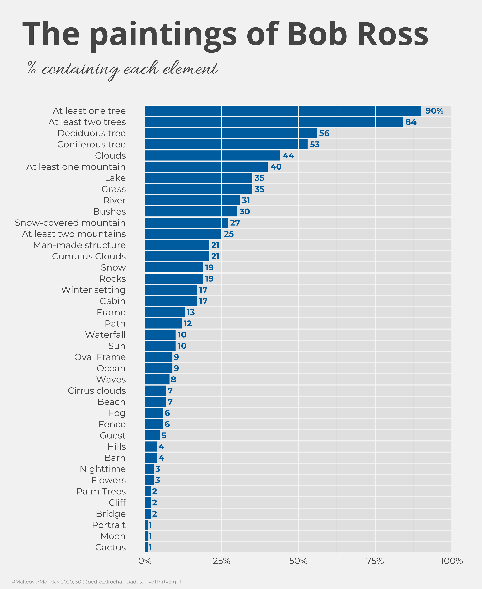
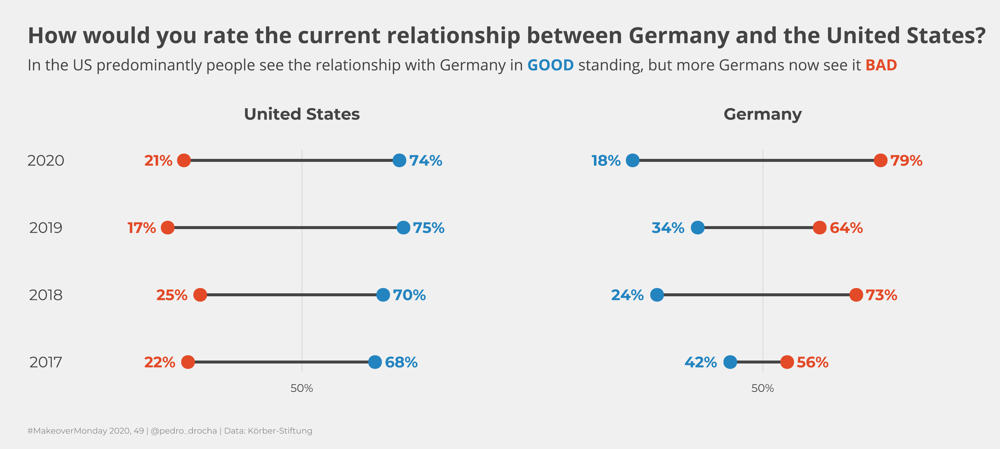
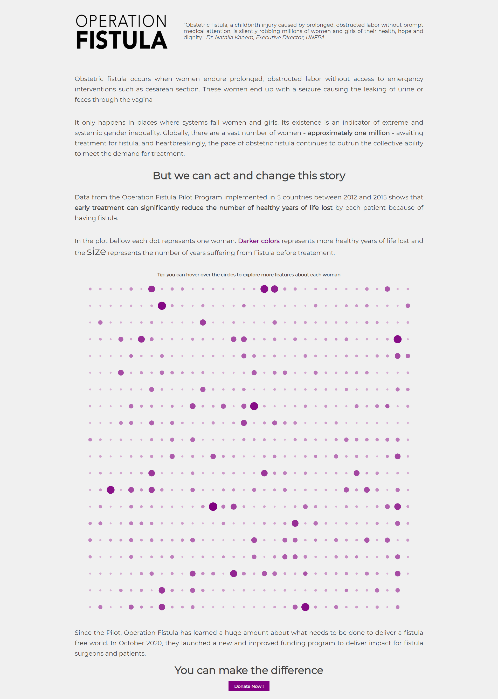

# MakeoverMonday

My contributions to [#MakeoverMonday](https://www.makeovermonday.co.uk/), a weekly social data project created in 2016 by [Eva Murray](https://twitter.com/TriMyData) and [Andy Kriebel](https://twitter.com/VizWizBI) aimed at working with a given data set and creating better, more effective visualizations.

## 2020, Week 50: Arsenal’s worst ever Premier League 
[Interactive Version](https://rpubs.com/pedro_drocha/706332)

## 2020, Week 50: A Statistical Analysis of the Work of Bob Ross

## 2020, Week 49: Divergent Opinions on Transatlantic Alliance 
  

## 2020, Week 48: The success of Operation Fistula’s Pilot Program 
[Interactive version](https://pedrodrocha.com/makeovermonday/Week48/operationfistula)
  

